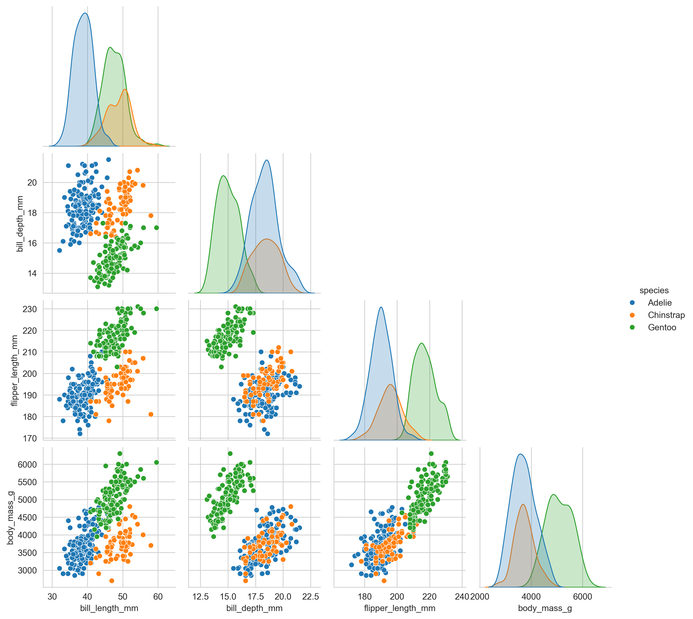
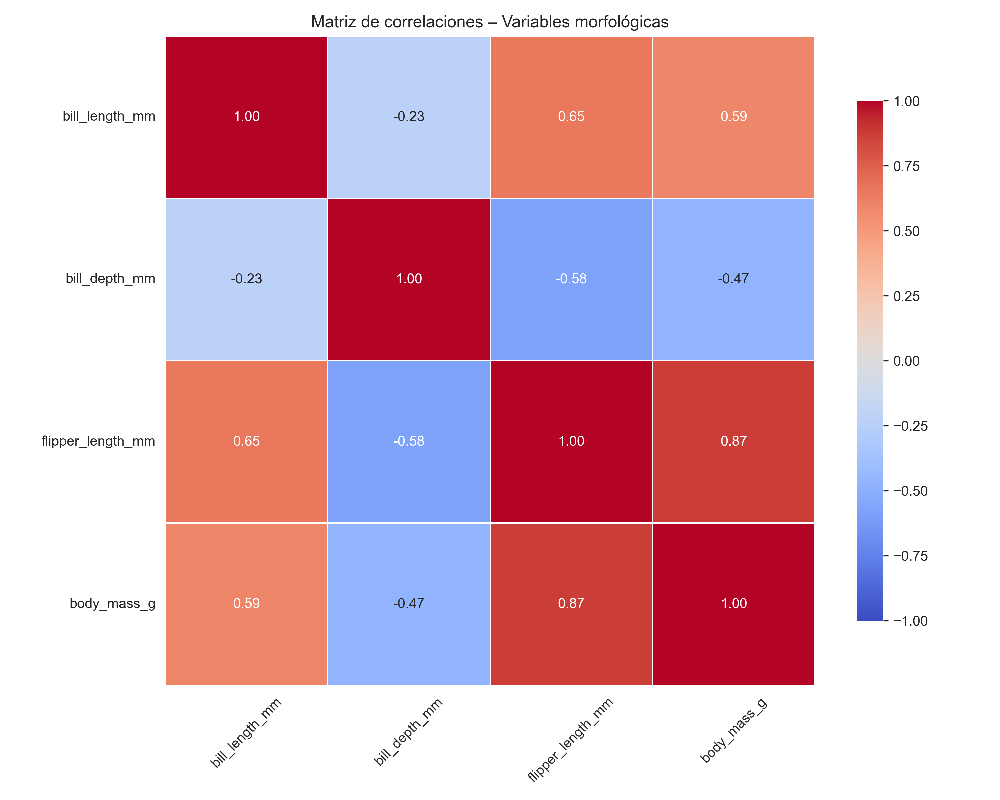

# Análisis de Componentes Principales (ACP) y Clustering en Pingüinos de Palmer

Este proyecto corresponde a una tarea del Máster en Minería de Datos y Visualización. Se aplica un enfoque estadístico multivariante que combina **Análisis de Componentes Principales (ACP)** y **Clustering no supervisado** para explorar la estructura morfológica de pingüinos sin usar etiquetas de especie en el agrupamiento.

---

## 🎯 Objetivo del proyecto

- Representar la variabilidad morfológica de forma reducida y visual.
- Identificar patrones naturales en los datos mediante clustering.
- Comparar las agrupaciones con las especies reales (Adelie, Chinstrap, Gentoo).
- Interpretar el perfil morfológico medio de cada grupo.

---

## 📊 Análisis exploratorio

Se realizó una primera inspección visual y numérica para evaluar:

- Distribución conjunta de las variables morfológicas por especie.
- Correlaciones lineales entre variables.

**Figuras:**

- 📌 `Pairplot` de las variables coloreado por especie:

  

- 📌 Mapa de calor de correlaciones:

  

---

## 🧪 Metodología

### 1. Preparación de datos
- Se eliminaron valores nulos.
- Variables estandarizadas: `bill_length_mm`, `bill_depth_mm`, `flipper_length_mm`, `body_mass_g`.

### 2. ACP
- Se retuvieron 2 componentes principales explicando el **88.1 % de la varianza**.
- Se visualizaron:
  - Scree plot
  - Círculo de correlaciones
  - Dispersión de individuos (PC1 vs PC2)

📌 Ejemplo:

---

### 3. Clustering jerárquico (Ward)
- Distancias euclídeas sobre componentes principales.
- Corte visual en el dendrograma sugiere **k = 3**.

📌 Ejemplo:

---

### 4. Clustering particional (K-means)
- Evaluación con gráfico del codo y silueta media.
- Se seleccionó **k = 5** como solución final.

📌 Ejemplos:

  

---

### 5. Perfilado morfológico
Se calcularon medias y desviaciones por grupo K-means, y se representaron en un gráfico radar.

📌 Ejemplo:

---

## 🧠 Principales hallazgos

- El clustering jerárquico reproduce la clasificación por especie con k = 3.
- K-means con k = 5 revela subgrupos más detallados:
  - Gentoo se divide en dos clústeres distintos por tamaño.
  - Chinstrap forma un grupo denso y homogéneo.
  - Adelie se divide, y uno de los grupos (grupo 4) se superpone con Chinstrap.

**Grupo 4** destaca por su morfología intermedia, lo que podría indicar:

- Un proceso de hibridación natural.
- Una diferenciación morfológica incipiente.

---

## ⚠️ Limitaciones

- La elección de `k` en K-means implica interpretación subjetiva.
- PCA es lineal: no capta relaciones no lineales.
- No se usó validación genética ni geográfica externa.
- Tamaño muestral relativamente pequeño.

---

## 📁 Estructura del repositorio

Proyecto_Penguins_Clustering/
├── Proyecto_Penguins_Clustering.ipynb # Notebook principal con todas las fases A–H
├── TAREA GERSON CASTILLO MINERIA DE DATOS - CLUSTERING.pdf # Informe académico
├── FuncionesMineria2.py # Funciones oficiales
├── /fig
│ ├── fig_00_pairplot.png
│ ├── fig_01_heatmap_corr.png
│ ├── fig_04_circulo_correlaciones.png
│ ├── fig_06_dendrograma_ward.png
│ ├── fig_07_kmeans_codo.png
│ ├── fig_08_silueta.png
│ └── fig_09_radar_clusters.png
└── README.md

---

## 📄 Informe final

Consulta el documento con la explicación detallada, redacción académica y todas las fases del análisis:

📎 [`TAREA GERSON CASTILLO MINERIA DE DATOS - CLUSTERING.pdf`](./TAREA%20GERSON%20CASTILLO%20MINERIA%20DE%20DATOS%20-%20CLUSTERING.pdf)

---

## 👤 Autor

**Gerson Castillo**  
Máster en Minería de Datos y Visualización  
[Nombre de la Universidad]

